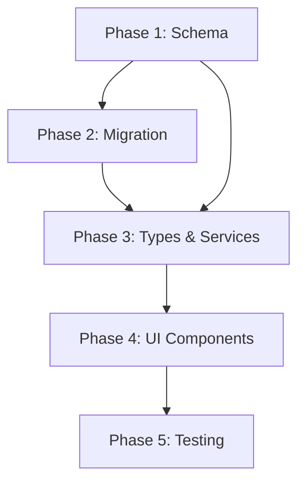

# Implementation Plan: Multi-Tenant Company Data Model

**Branch**: `012-multi-tenant-companies` | **Date**: 2025-12-06 | **Spec**: [spec.md](./spec.md)
**Input**: Feature specification from `/specs/012-multi-tenant-companies/spec.md`

## Summary

Transform the single-user company data model into a multi-tenant architecture with:

- Shared company registry (deduplicated, admin-managed)
- User-specific tracking records (status, priority, notes)
- Metro area organization with PostGIS spatial queries
- Moderated community contributions (soft addition pattern)
- Big-bang migration of 83 existing companies with backup recovery option

## Technical Context

**Language/Version**: TypeScript 5.x, Next.js 15.5+, React 19+
**Primary Dependencies**: Supabase (PostgreSQL), PostGIS, pg_trgm, DaisyUI/Tailwind CSS 4
**Storage**: PostgreSQL via Supabase (free tier), monolithic migration file
**Testing**: Vitest (unit), Playwright (E2E), Pa11y (accessibility)
**Target Platform**: Static web export (GitHub Pages), PWA-capable
**Project Type**: Web application with static export
**Performance Goals**: <1s page load for 1000 companies, <30s add-company flow
**Constraints**: Static hosting (no API routes), RLS for data isolation, offline-capable
**Scale/Scope**: 50+ metro areas, 10,000+ shared companies, 100,000+ users

## Constitution Check

_GATE: Must pass before Phase 0 research. Re-check after Phase 1 design._

| Principle                    | Status | Notes                                 |
| ---------------------------- | ------ | ------------------------------------- |
| I. Component Structure       | PASS   | Will use generator for new components |
| II. Test-First Development   | PASS   | Tests written before implementation   |
| III. PRP Methodology         | PASS   | Following SpecKit workflow            |
| IV. Docker-First Development | PASS   | All commands via Docker               |
| V. Progressive Enhancement   | PASS   | Core functionality works offline      |
| VI. Privacy & Compliance     | PASS   | RLS isolates user data                |
| VII. Company Tracking        | PASS   | Enhanced with shared + private model  |
| VIII. Geographic Accuracy    | PASS   | PostGIS for accurate spatial queries  |
| IX. Route Clusters           | PASS   | Metro areas organize companies        |
| X. Bicycle Routing           | N/A    | Not modified by this feature          |
| XI. Multi-Format Export      | N/A    | Not modified by this feature          |
| XII. Field Operations        | PASS   | Unified view works offline            |

**Gate Result**: PASS - No violations requiring justification.

## Project Structure

### Documentation (this feature)

```
specs/012-multi-tenant-companies/
├── spec.md              # Feature specification (complete)
├── plan.md              # This file
├── research.md          # Phase 0 output (complete)
├── data-model.md        # Phase 1 output (complete)
├── quickstart.md        # Phase 1 output (complete)
├── contracts/           # Phase 1 output (complete)
│   └── company-api.yaml # OpenAPI spec for company operations
└── tasks.md             # Phase 2 output (/tasks command)
```

### Source Code (repository root)

```
src/
├── components/
│   ├── organisms/
│   │   ├── CompanyForm/          # UPDATE: Add match detection UI
│   │   ├── CompanyTable/         # UPDATE: Unified view (shared + private)
│   │   ├── CompanyDetailDrawer/  # UPDATE: Show origin badge
│   │   └── AdminModerationQueue/ # NEW: Contribution review UI
│   └── molecular/
│       ├── CompanyRow/           # UPDATE: Origin badge display
│       └── CompanyMatchSuggestion/ # NEW: Match suggestion card
├── lib/
│   └── companies/
│       ├── company-service.ts    # UPDATE: Multi-tenant queries
│       └── match-service.ts      # NEW: Fuzzy matching logic
├── types/
│   └── company.ts                # UPDATE: New interfaces
└── app/
    └── admin/
        └── moderation/           # NEW: Admin moderation page

supabase/migrations/
└── 20251006_complete_monolithic_setup.sql  # UPDATE: Add 7 new tables

data/
└── seed/
    └── cleveland-tn/
        └── companies.json        # NEW: Metro area seed data
```

**Structure Decision**: Web application with existing Next.js structure. New components follow atomic design (organisms for complex UI, molecular for simple). Database changes go in monolithic migration file per project convention.

## Implementation Phases

### Phase 1: Database Schema (Foundation)

1. Enable PostgreSQL extensions: `postgis`, `pg_trgm`
2. Create new tables in monolithic migration:
   - `metro_areas` - Geographic regions
   - `shared_companies` - Deduplicated company registry
   - `company_locations` - Physical addresses per company
   - `user_company_tracking` - User's relationship to shared companies
   - `private_companies` - User-owned companies
   - `company_contributions` - Pending new company submissions
   - `company_edit_suggestions` - Pending data corrections
3. Create RLS policies for each table
4. Create `user_companies_unified` view
5. Add `is_admin` column to user profiles
6. Create trigger for metro_area auto-inference

### Phase 2: Data Migration

1. Backup existing `companies` table data
2. Create "Cleveland, TN" metro area record
3. Insert existing 83 companies into `shared_companies` + `company_locations`
4. Create `user_company_tracking` records for current user
5. Update `job_applications` to reference new structure
6. Drop old `companies` table

### Phase 3: TypeScript Types & Services

1. Define new interfaces in `src/types/company.ts`
2. Create `match-service.ts` for fuzzy company matching
3. Update `company-service.ts` to query unified view
4. Add contribution submission functions

### Phase 4: UI Components

1. Update `CompanyTable` for unified view
2. Add `CompanyMatchSuggestion` molecular component
3. Update `CompanyForm` with match detection
4. Add origin badge to `CompanyRow` and `CompanyDetailDrawer`
5. Create `AdminModerationQueue` organism

### Phase 5: Integration & Testing

1. Write unit tests for match-service
2. Write E2E tests for add-company flow
3. Test RLS policies with multiple users
4. Verify migration rollback procedure

## Complexity Tracking

No constitution violations requiring justification.

## Dependencies



## Risk Mitigation

| Risk                             | Impact | Mitigation                                      |
| -------------------------------- | ------ | ----------------------------------------------- |
| Migration data loss              | HIGH   | Backup file exists, monolithic SQL for rollback |
| PostGIS not available            | MEDIUM | Verified available on Supabase free tier        |
| RLS policy errors                | HIGH   | Test with multiple test users before deploy     |
| Match algorithm too strict/loose | LOW    | 0.3 threshold adjustable, monitor in production |

## Success Validation

- [ ] All 83 companies visible in unified view
- [ ] New company triggers match detection
- [ ] User tracking isolated (RLS verified)
- [ ] Admin can access moderation queue
- [ ] Page load < 1 second
- [ ] Zero data loss confirmed
